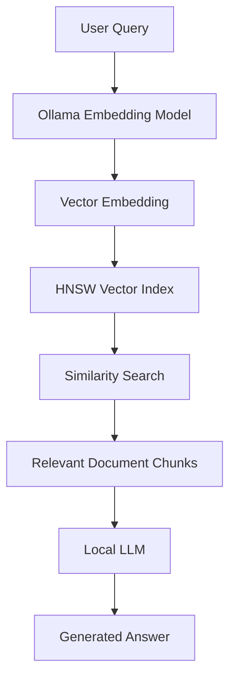
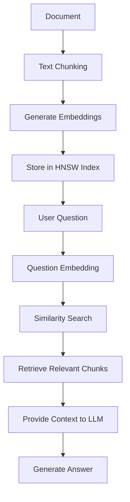

# VectorDB — C++ Vector Database

A C++ vector database with a web interface for vector similarity search, HNSW, KD-Tree, Brute Force search, document embeddings, and RAG using Ollama.

## Features

- HNSW, KD-Tree, and Brute Force search
- Cosine, Euclidean, and Manhattan distance metrics
- Demo vectors with PCA visualization
- Document embeddings using `nomic-embed-text`
- RAG pipeline using a local LLM
- REST API
- Web-based interface

## Technologies

- C++17
- HNSW
- KD-Tree
- Ollama
- HTML / CSS / JavaScript
- REST API

## How It Works

The system converts text into vector embeddings, stores them in an HNSW index, retrieves relevant information through similarity search, and uses a local LLM to generate responses.



## RAG Pipeline

The project implements a Retrieval-Augmented Generation pipeline that combines vector search with a locally hosted language model.



### RAG Workflow

1. **Document Processing** — Documents are divided into smaller chunks.
2. **Embedding Generation** — Each chunk is converted into a vector using `nomic-embed-text`.
3. **Vector Storage** — Embeddings are stored in an HNSW index.
4. **Query Processing** — The user's question is converted into an embedding.
5. **Similarity Search** — HNSW retrieves the most relevant document chunks.
6. **Context Retrieval** — Retrieved chunks are provided as context to the LLM.
7. **Answer Generation** — The local LLM generates a response based on the retrieved context.

## Requirements

- Windows
- C++17 compiler (MSYS2/MinGW)
- Git
- Ollama

## Installation

### 1. Install MSYS2

Download MSYS2:

https://www.msys2.org/

Open the **MSYS2 UCRT64** terminal and run:

```bash
pacman -Syu
pacman -S mingw-w64-ucrt-x86_64-gcc
```

Add the following directory to your Windows PATH:

```text
C:\msys64\ucrt64\bin
```

Verify:

```powershell
g++ --version
```

### 2. Install Git

Download Git:

https://git-scm.com/download/win

Verify:

```powershell
git --version
```

### 3. Install Ollama

Download:

https://ollama.com/

Pull the required models:

```powershell
ollama pull nomic-embed-text
ollama pull llama3.2
```

Verify:

```powershell
ollama list
```

## Clone the Repository

```powershell
git clone https://github.com/YOUR_USERNAME/YOUR_REPOSITORY.git
cd YOUR_REPOSITORY
```

## Build

```powershell
g++ -std=c++17 -O2 main.cpp -o db -lws2_32
```

## Run

Start Ollama:

```powershell
ollama serve
```

In another terminal:

```powershell
.\db.exe
```

Open:

```text
http://localhost:8080
```

## Using the Application

### Vector Search

- Select **HNSW**, **KD-Tree**, or **Brute Force**
- Select **Cosine**, **Euclidean**, or **Manhattan**
- Search vectors
- Compare search algorithms
- Visualize demo vectors using PCA

### Documents

1. Enter a document title.
2. Paste the document text.
3. Click **Embed & Insert**.
4. The document is divided into chunks.
5. Each chunk is converted into an embedding using `nomic-embed-text`.
6. The embeddings are stored for similarity search.

### Ask AI

1. Add documents.
2. Enter a question.
3. Click **Ask AI**.
4. HNSW retrieves relevant document chunks.
5. The retrieved context is sent to the local LLM.
6. The LLM generates the answer.

## REST API

| Method | Endpoint | Description |
|---|---|---|
| GET | `/search` | Search vectors |
| POST | `/insert` | Insert a vector |
| DELETE | `/delete/:id` | Delete a vector |
| GET | `/items` | List vectors |
| GET | `/benchmark` | Compare search algorithms |
| GET | `/hnsw-info` | HNSW information |
| GET | `/stats` | Database statistics |
| POST | `/doc/insert` | Insert a document |
| GET | `/doc/list` | List documents |
| DELETE | `/doc/delete/:id` | Delete a document |
| POST | `/doc/ask` | RAG query |
| GET | `/status` | Ollama status |

## Project Structure

```text
VectorDB/
├── main.cpp
├── httplib.h
├── index.html
├── LICENSE
└── README.md
```

## Algorithms

### HNSW

**Hierarchical Navigable Small World (HNSW)** is a graph-based approximate nearest-neighbor search algorithm that organizes vectors into multiple graph layers.

### KD-Tree

A KD-Tree partitions multidimensional space and reduces the number of points examined during a search.

### Brute Force

Brute Force compares the query vector with every stored vector and provides an exact search baseline.

## Distance Metrics

### Cosine Similarity

Measures similarity between two vectors based on the angle between them.

### Euclidean Distance

Measures the straight-line distance between two points in vector space.

### Manhattan Distance

Calculates distance by summing the absolute differences between corresponding dimensions.

## Limitations

- Intended primarily for educational and experimental use
- Performance depends on hardware and dataset size
- KD-Tree becomes less efficient with high-dimensional vectors
- Local LLM inference can require significant system resources

## Acknowledgement

This repository is based on the open-source **Your-OWN-AI** project by **Perry Vegehan**.

Original repository:

https://github.com/perryvegehan/Your-OWN-AI

The original project is released under the **MIT License**.
